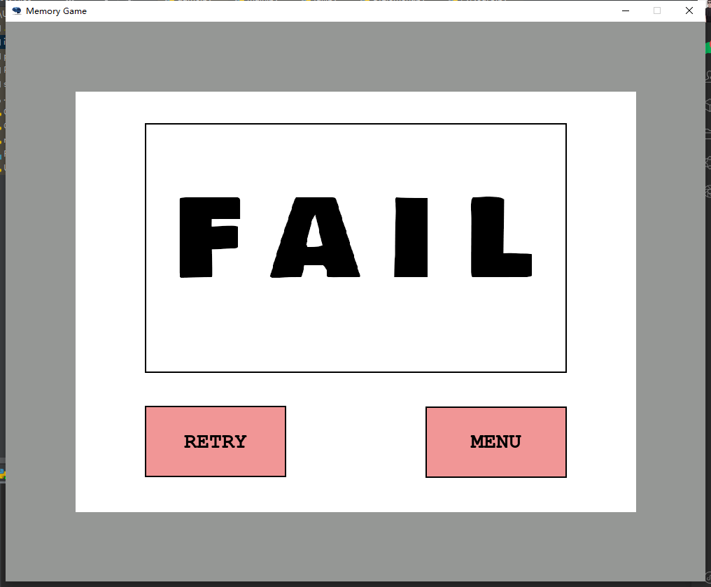

# EEG-Matching-Game-Puzzle
This project is a submission of topic "Brain Controlled Adaptive Interface" in COMPSCI 705 course of UoA.

It is an EEG device (NeuroSky MindWave Mobile 2) enhanced Memory Card game, which has the similar way in playing.

# Instruction

1. Before starting this game, you need to download [ThinkGear Connector](http://developer.neurosky.com/docs/doku.php?id=thinkgear_connector_tgc) and run it for the connectivity of the headset. Please keep Thinkgear Connecter on while the game is running.
2. You will need PyCharm or similar Python IDE, first download it.
3. Make sure you have installed Python 3.7 or above.
4. Install Pygame in your Python IDE terminal by typing in `pip install pygame`.
5. Download files from this repo, unzip and create a new project in your Python IDE.
6. Run the main.py file to play.

# How to Play

You will have 60s to play this game, so you should concentrate on completing the game to win high scores. The object of the game is to find all the pairs with the fewest number of moves and in the shortest possible time. The EEG device can help you gain more game time and score if you maintain a high attention level for a certain amount of time.

1. There are ten unique pairs of cards, making 20 cards total.
2. Cards are laid out in a 4×5 grid face down, all the cards are mixed up and laid in rows, face down on the table. You can flip any pair of cards on each turn.
3. If the two cards match, you score, the two cards are turned over and fixed, you can get to the next turn. If they do not match, the cards are turned back.
4. When cards are turned over, it is important to remember where they are for when the matching card is turned up later in the game.

# Screenshots

# Possible issue

Due to the lockdown and device availability, only one person of our group can do the development. So this will lead possible issue when playing the game, which includes:

`Invalid "Retry" and "Menu" button.`

Made with ♥, [PyNeuro](https://github.com/ZACHSTRIVES/PyNeuro) and [Pygame](https://github.com/pygame/pygame) by Group 7 members.